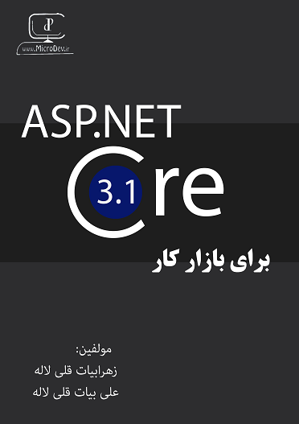

## Give a Star! :star:
If you like this project, learn something or you are using it in your applications, please give it a star. Thanks!

# Practical ASP.NET Core

Welcome to the Git repo that is associated with the book
**[Practical ASP.NET Core](https://github.com/ZahraBayatgh/PracticalASP.NETCore/raw/master/PracticalASPNETCore.pdf)**
published by [LinkedIn](https://www.linkedin.com/posts/alibayatgh_practical-aspnet-core-book-in-farsi-activity-6628561080027230209-jK8H).
This book details how to use 
[ASP.NET Core](https://docs.microsoft.com/en-us/aspnet/core/?view=aspnetcore-3.1) (ASP.NET Core)
to develop web application in [.NET Core](https://www.microsoft.com/net) applications.

This Git repo contains all the code in the book, plus an
[free pdf book](https://github.com/ZahraBayatgh/PracticalASP.NETCore/raw/master/PracticalASPNETCore.pdf)
that I wrote, in persian.

| Practical ASP.NET Core |
| ------------|
|  |  |  |
|  <a href='https://github.com/ZahraBayatgh/PracticalASP.NETCore/raw/master/PracticalASPNETCore.pdf'>**Download .PDF**</a>   
